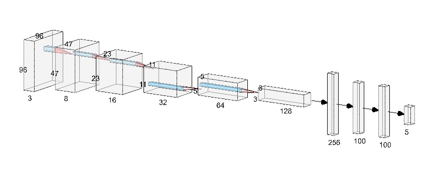

# Car Racing Deep Q Network

This code implements an agent to solve the gym's CarRacing problem. Here we implemented 2 different networks architectures to compare their performance in the same agent.

## Deep Q Network Custom Architecture
The custom architecture is a CNN to extract features of the state, that is in this case the image of the racing car in the speedway. Further, the features are flattered and within some fully connected layers this network will yield a tensor of size five, with the Q-Value for each of the 5 possible actions.
The Architecture of the network can be seen below.

